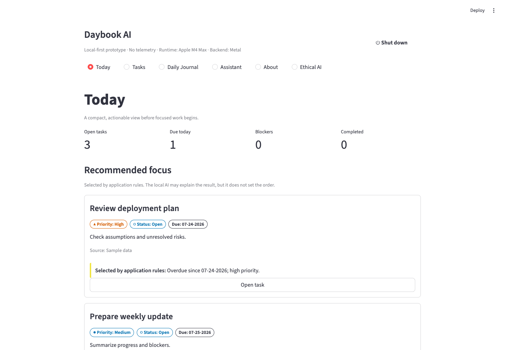
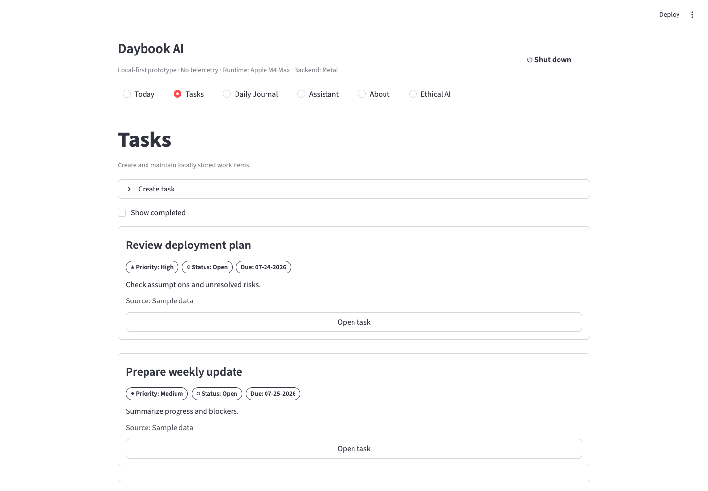
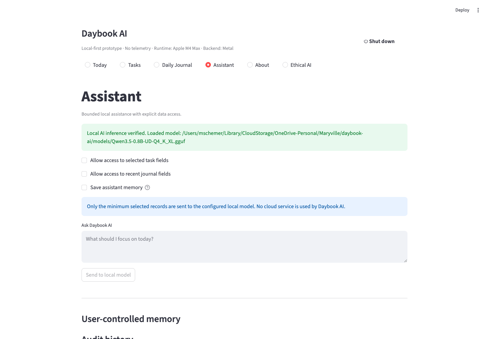
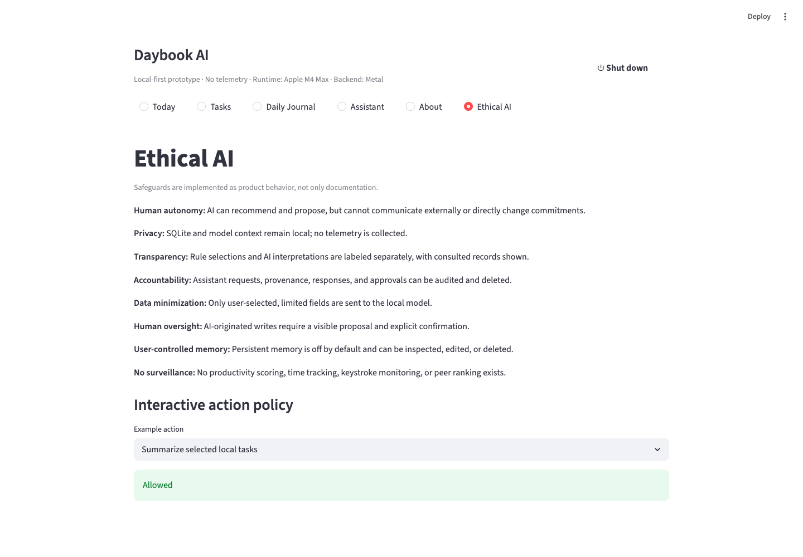

# Daybook AI

Daybook AI is a compact, local-first task manager and daily journal for working professionals who want to organize responsibilities before focused work. It combines deterministic prioritization with a bounded local language model that may explain, summarize, and propose—but never directly write to the database.

Designed and coded by **Michael Schemer** as an Ethical AI course prototype.

> **Core principle:** Rules determine. AI explains. AI proposes. Humans approve.

## Screenshots

### Today dashboard



### Task management



### Local assistant



### Ethical AI controls



Additional screenshots are available in:

- [`docs/screenshots/light/`](docs/screenshots/light/)
- [`docs/screenshots/dark/`](docs/screenshots/dark/)

## Video demo

A recorded Daybook AI v0.9 walkthrough demonstrates installation, local-model startup, deterministic ranking, grounded AI explanations, human-reviewed task decomposition, and clean shutdown.

**Demo video:** _Add the published video URL here after the final recording is uploaded._

## Features

- Today view with open tasks, due-today tasks, blockers, and three rule-selected focus items.
- Typed deterministic focus facts with deliberate, grounded local-AI explanations and deterministic fallback.
- Full local task CRUD with provenance.
- Epic/subtask hierarchy and deterministic task dependencies with lifecycle guards.
- User-entered time entries kept separate from estimates, with per-entry and daily limits.
- Governed deletion previews that preserve timed subtasks when an epic is deleted.
- Deterministic decomposition classification, focused readiness clarification, strictly validated AI drafts, and editable human review before approval.
- Stable proposal-local review keys, application-verified provenance, atomic task creation, and durable duplicate protection.
- Date-based daily journal and previous-entry review.
- Local-model assistant with explicit task/journal access controls.
- User-controlled memory, disabled by default.
- Local audit history that can be inspected and deleted.
- Interactive Ethical AI action-policy examples.
- Limited mode when the model server is offline.
- Cross-platform installation and runtime bootstrap for Windows, macOS, and Linux.

## Architecture

Daybook AI uses:

- **Python 3.12.x** for the application runtime.
- **Streamlit 1.56.0** for the user interface.
- **SQLite** for local persistent data.
- **llama.cpp** for local model serving.
- **Qwen3.5-0.8B GGUF** as the default local model.

The model is intentionally subordinate to deterministic application logic. Task ranking, validation, dependency effects, persistence, and approval rules remain application-controlled.

## Recommended local model

The default model is **`unsloth/Qwen3.5-0.8B-GGUF`**, using:

```text
Qwen3.5-0.8B-UD-Q4_K_XL.gguf
```

Model repository:

```text
https://huggingface.co/unsloth/Qwen3.5-0.8B-GGUF
```

The launcher uses an existing `.gguf` model when one is already available and does not overwrite it. Another instruction-tuned GGUF can be selected with `DAYBOOK_MODEL_PATH` in `.env`.

## Install Daybook AI

The repository includes installation scripts so a user does not need to manually create the virtual environment or install Python packages one at a time.

### macOS or Linux

```bash
git clone https://github.com/mschemerii/daybook-ai.git
cd daybook-ai
bash install.sh
```

The shell installer:

1. Checks for a compatible Python 3.12.x runtime.
2. Creates or reuses the project-local `.venv`.
3. Installs and verifies packages from `requirements.txt` when needed.
4. Runs the project preflight checks.
5. Creates `.env` from `.env.example` when `.env` does not already exist.
6. Preserves an existing `.env` instead of overwriting user configuration.
7. Offers to launch Daybook AI when environment setup is complete.

Useful installer options:

```bash
bash install.sh --yes
bash install.sh --no-launch
bash install.sh --yes --no-launch
```

`--yes` (or `-y`) accepts installer confirmations. `--no-launch` prepares the environment without starting the application.

After installation, launch with:

```bash
./run.sh
```

If the executable bit is unavailable:

```bash
bash run.sh
```

The virtual environment does not need to be activated manually; `run.sh` uses `.venv/bin/python` directly.

### Windows

Clone the repository and run the batch installer:

```bat
git clone https://github.com/mschemerii/daybook-ai.git
cd daybook-ai
install.bat
```

`install.bat` invokes the PowerShell installer. The equivalent PowerShell command is:

```powershell
.\install.ps1
```

Optional PowerShell switches are:

```powershell
.\install.ps1 -Yes
.\install.ps1 -NoLaunch
.\install.ps1 -Yes -NoLaunch
```

After installation, launch with:

```bat
run.bat
```

`run.bat` uses `.venv\Scripts\python.exe` directly.

## First launch and local AI bootstrap

Environment installation and application startup are intentionally separated.

When Daybook AI starts, `run.py` checks the local runtime and handles missing local-AI components. It can:

1. Detect the operating system, CPU architecture, and supported GPU hardware.
2. Use a configured or `PATH`-available `llama-server` when it passes validation.
3. Otherwise install the pinned project-compatible llama.cpp runtime for the detected platform/backend.
4. Verify runtime archives and executables before reuse.
5. Use an existing GGUF model or download the default Qwen model when none is available.
6. Start the authenticated llama.cpp server.
7. Send a real test request to `/v1/chat/completions` before reporting AI inference as verified.
8. Start Streamlit and the loopback-only browser controller.
9. Open Daybook AI at `http://127.0.0.1:8500`.
10. Keep task and journal functionality available in limited mode if local AI cannot be started or verified.

Internet access is needed only when a missing runtime component or model must be downloaded. Daybook AI does not use cloud AI for normal task, journal, or assistant processing.

## Configuration

The installer creates `.env` from `.env.example` when necessary. Current defaults include:

```dotenv
DAYBOOK_DB_PATH=data/daybook.db
DAYBOOK_MODEL_BASE_URL=http://127.0.0.1:8080/v1
DAYBOOK_MODEL_NAME=auto
DAYBOOK_MODEL_PATH=models/Qwen3.5-0.8B-UD-Q4_K_XL.gguf
DAYBOOK_LLAMA_SERVER=llama-server
DAYBOOK_MODEL_HOST=127.0.0.1
DAYBOOK_MODEL_PORT=8080
DAYBOOK_MODEL_CONTEXT_SIZE=4096
DAYBOOK_CONTROLLER_HOST=127.0.0.1
DAYBOOK_CONTROLLER_PORT=8500
DAYBOOK_STREAMLIT_HOST=127.0.0.1
DAYBOOK_STREAMLIT_PORT=8501
```

Managed services are restricted to loopback addresses. Authentication tokens are generated per launch when they are not explicitly configured.

## Run Daybook AI

The recommended launch commands are:

### macOS or Linux

```bash
./run.sh
```

### Windows

```bat
run.bat
```

You can also invoke the Python launcher directly from an activated compatible environment:

```bash
python run.py
```

### `run.py` options

The command-line modes are mutually exclusive.

| Command | Purpose |
|---|---|
| `python run.py` | Start Daybook AI, bootstrap/verify the local AI runtime, start Streamlit, and open the browser. |
| `python run.py --status` | Report whether the managed Daybook AI instance is running. |
| `python run.py --stop` | Request the same authenticated graceful shutdown used by the in-app **Shut down** control. |
| `python run.py --screenshots light` | Start the app, capture the implemented pages in light mode, then stop launcher-owned services. |
| `python run.py --screenshots dark` | Capture the implemented pages in dark mode. |
| `python run.py --screenshots both` | Capture both light and dark screenshot sets. |
| `python run.py --help` | Show the launcher help text. |

The wrapper scripts forward launcher options, so these also work:

```bash
./run.sh --status
./run.sh --stop
./run.sh --screenshots both
```

Windows equivalents:

```bat
run.bat --status
run.bat --stop
run.bat --screenshots both
```

## Shutdown behavior

The preferred shutdown method is the **Shut down** control in the Daybook AI interface.

The browser moves to a stable local goodbye page, Streamlit stops, and llama.cpp is terminated only when Daybook AI started that process. An externally managed llama.cpp server is left running.

Terminal shutdown is also available:

```bash
python run.py --stop
```

The launcher stores only the local controller information needed to manage the running instance in the git-ignored `.daybook-runtime.json` file and removes it during normal shutdown.

## Capture screenshots

Google Chrome must already be installed. Playwright uses the installed Chrome channel.

```bash
python run.py --screenshots light
python run.py --screenshots dark
python run.py --screenshots both
```

Captured images are written to:

```text
docs/screenshots/light/
docs/screenshots/dark/
```

The tracked project currently includes Today, Tasks, Daily Journal, Assistant, About, Ethical AI, and Task Detail screenshots in both themes.

## Verify local inference

Successful startup includes output similar to:

```text
Local AI inference verified. Loaded model: Qwen3.5-0.8B-UD-Q4_K_XL.gguf
```

This is more than a simple process or health check. Daybook AI reads the llama.cpp model endpoint and sends a small real completion request before the Assistant is treated as available.

If inference verification fails, Tasks and Daily Journal remain available in limited mode.

## Run tests

Run the project test suite with:

```bash
pytest -q
```

Additional project validation and UI testing guidance is available in [`UI_TESTING.md`](UI_TESTING.md) and [`docs/VALIDATION_REPORT.md`](docs/VALIDATION_REPORT.md).

## Ethical safeguards

- Rule-based prioritization is visibly separated from AI explanation.
- Ranking explanations are grounded in application-supplied facts and have deterministic fallback behavior.
- The model receives only user-selected, minimized records.
- No cloud AI service or telemetry is required for normal operation.
- Hardware detection uses local operating-system information only.
- The model cannot write directly to SQLite.
- Task-decomposition output is validated by application code before it can enter review.
- Draft items can be renamed, edited, inserted, removed, reordered, selected, deselected, and linked before approval.
- Explicit approval applies the reviewed task structure transactionally.
- Duplicate approval is protected by durable proposal identity and idempotency checks.
- Persistent memory is off by default and remains user-controlled.
- Audit history is local and deletable.
- No productivity scoring, surveillance, keystroke monitoring, peer ranking, or shaming language is included.

See [`docs/ETHICAL_AI.md`](docs/ETHICAL_AI.md) for additional design details.

## Limitations

- Daybook AI is a single-user local prototype, not a completed commercial product.
- It has per-launch local service tokens but no user-account system or encryption-at-rest layer.
- Small local models may produce weak, malformed, or invalid answers.
- Unsupported or unavailable hardware acceleration falls back to CPU and may be slower.
- Phase 7 review/approval is concentrated in the existing task-decomposition workflow.
- Reporting/export work and broader Phase 9 UI integration remain deferred.
- The assistant has no external information, email, calendar, or internet tools.

## Future plans and roadmap

Near-term work remains intentionally bounded so the current ethical and local-first architecture stays intact.

### Planned next steps

- Complete deterministic time reporting across daily, weekly, monthly, quarterly, yearly, and custom ranges.
- Add PDF and CSV/ZIP export without involving the language model in report calculation.
- Complete broader UI integration for remaining reporting/export workflows.
- Continue cross-platform installer and runtime validation on Windows, macOS, and Linux.
- Expand automated testing around startup, shutdown, failure recovery, and offline/limited mode.

### Longer-term possibilities

Possible local specialist modules include:

- Planning specialist.
- Journal summarizer.
- Blocker-review assistant.
- Meeting-note importer.
- Privacy/audit reviewer.

A future multi-agent design could place a small local orchestrator above those specialists, but only with explicit typed requests, least-privilege access, provenance, policy enforcement, confirmation gates, and a shared local audit layer.

The current prototype does **not** dynamically create agents, delegate autonomously, communicate externally, or permit a model to write directly to application data.

See [`docs/FUTURE_ROADMAP.md`](docs/FUTURE_ROADMAP.md) for the current roadmap statement.

## Streamlit compatibility note

Daybook AI pins Streamlit to `1.56.0`. The launcher checks the installed Streamlit version and installs the compatible release when Streamlit is missing or an incompatible newer version is present.

## Project status

Current v0.9 capabilities include:

- [x] Today, Tasks, Daily Journal, Assistant, About, and Ethical AI pages
- [x] Clickable task cards and editable task details
- [x] Epic/subtask hierarchy and dependency lifecycle controls
- [x] Multiple dated time entries with validation limits
- [x] Governed task deletion and deletion audit behavior
- [x] Deterministic focus ordering and visible ranking facts
- [x] Grounded local-AI explanations with deterministic fallback
- [x] Deterministic decomposition classification and readiness clarification
- [x] Strict AI decomposition proposals
- [x] Editable human review and application-owned provenance
- [x] Explicit atomic approval and durable duplicate protection
- [x] Local SQLite persistence
- [x] Local llama.cpp inference verification
- [x] Automatic model/runtime bootstrap when missing
- [x] GPU/backend detection with CPU fallback
- [x] Loopback-only managed services
- [x] Local audit history and user-controlled memory
- [x] Graceful browser and terminal shutdown controls
- [x] Light and dark screenshot capture modes
- [x] Offline/limited mode when the model is unavailable
- [ ] Deterministic reports and PDF/CSV export
- [ ] Broader Phase 9 UI integration

## Repository

```text
https://github.com/mschemerii/daybook-ai
```
